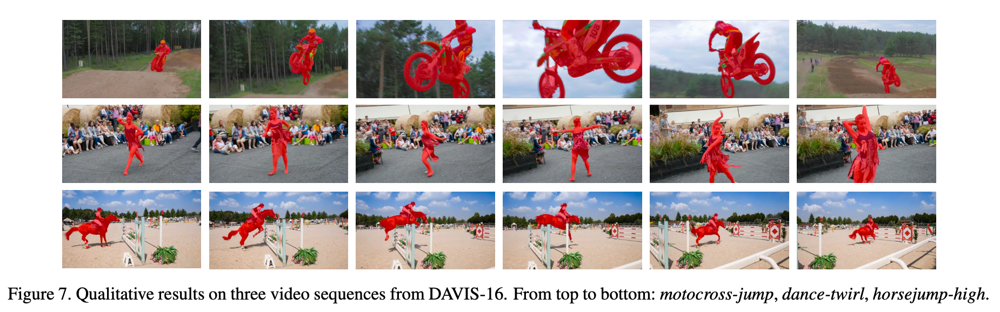

# Learning Motion-Appearance Co-Attention for Zero-Shot Video Object Segmentation (AMC-Net)


> Official implementation of 'Learning Motion-Appearance Co-Attention for Zero-Shot Video Object Segmentation', ICCV-2021 
> 
> in Pytorch



[Paper](https://openaccess.thecvf.com/content/ICCV2021/papers/Yang_Learning_Motion-Appearance_Co-Attention_for_Zero-Shot_Video_Object_Segmentation_ICCV_2021_paper.pdf)


## Installation

### Enviroment
* Python 3.6/3.7
* Pytorch
* Torchvision
* Numpy
* Pillow
* Opencv-python (cv2)
* Scikit-image
* Tqdm
* Cython
* Pydensecrf

If you have some problems installing `pydensecrf`, you can visit [pydensecrf](https://github.com/lucasb-eyer/pydensecrf) for more information.
### Datasets
In `datasets/dataloader_list`:

> `adaptor_dataset.py` and `adaptor_dataset_.py` are used to assemble the DAVIS and Youtube-VOS datasets to build the model dataset, in practice we only use DAVIS for training.
>
> `davis.py` and `tyb_vos.py` represent the data set construction rules, which can be modified to get the desired data list and stored in the cache (e.g. `datasets/DAVIS/cache/tran2016.pkl` and `datasets/DAVIS/cache/val2016.pkl`).
> 
> `custom_transforms_f.py` and `transform.py` contain some functions for data augmentation.
## Training
* Set the training sets in `utils/args.py` and `train.py` (Line 163 - Line 170).
* Run train.py
  ```shell
  python train.py
  ```

## Testing

* Test

  Please use `test.py` to generate results.
  ```shell
  python test.py
  ```
  Then you can get the predicted results in the `output/davis16/AMCNet/results` folder.

* CRF

  At the same time, CRF can be further performed on the predicted results, and the relevant code is in `utils/apply_densecrf_davis.py`.
  ```shell
  python utils/apply_densecrf_davis.py
  ```
  Then you can get the predicted results in the `output/davis16/AMCNet/results_crf` folder. 
  > Line 18: dataset images folder
  > 
  > Line 19: prediction mask folder
  > 
  > Line 20: crf prediction folder
## Metric

Please use the files in the `EVALVOS` folder to measure metrics.

Taking `test_for_davis.py` as an example:

> `Line 13`: Setup `db_info.yml`
> 
> `Line 14`: Set the folder of groundtruth
> 
> `Line 254`: Set the folder of images
> 
> `Line 255 & 256`: Whether to discard the first frame and the last frame
> 
> `Line 257`: Save output in `.pkl` format

## Tools
